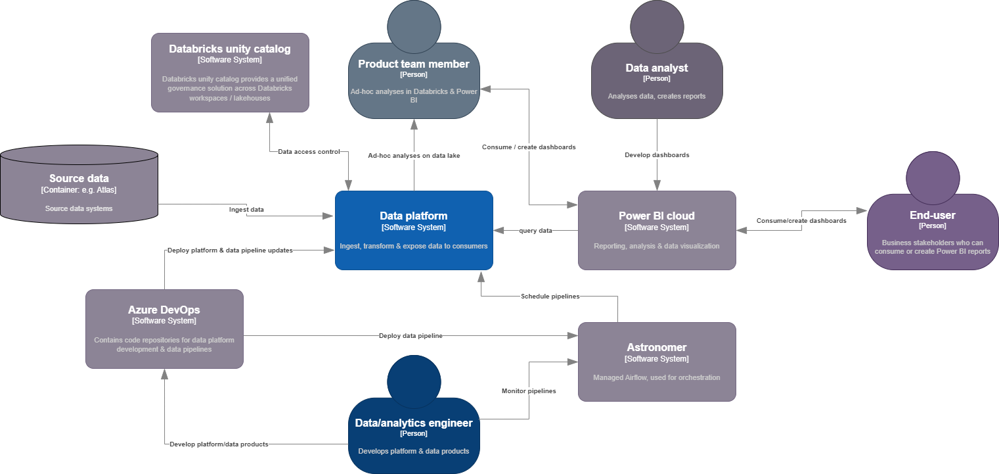
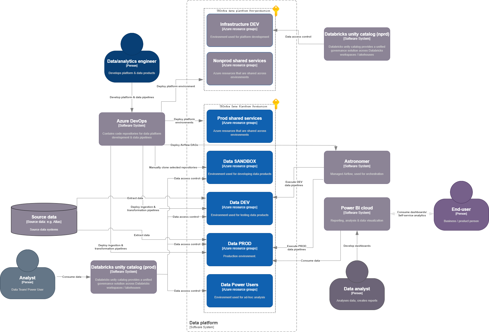
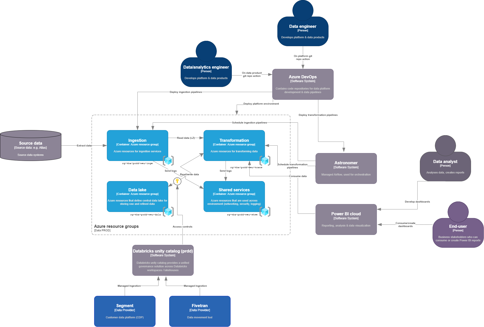
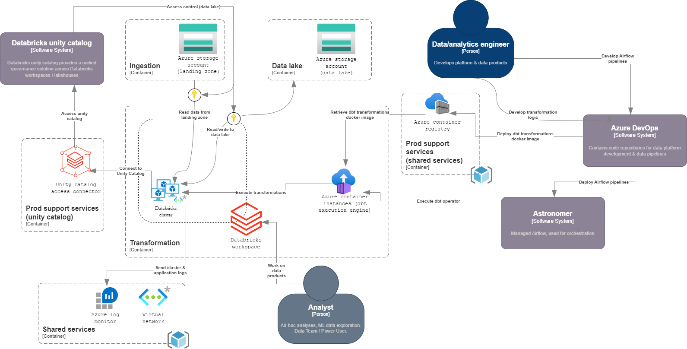
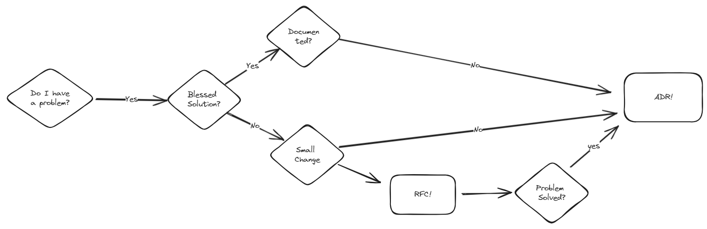
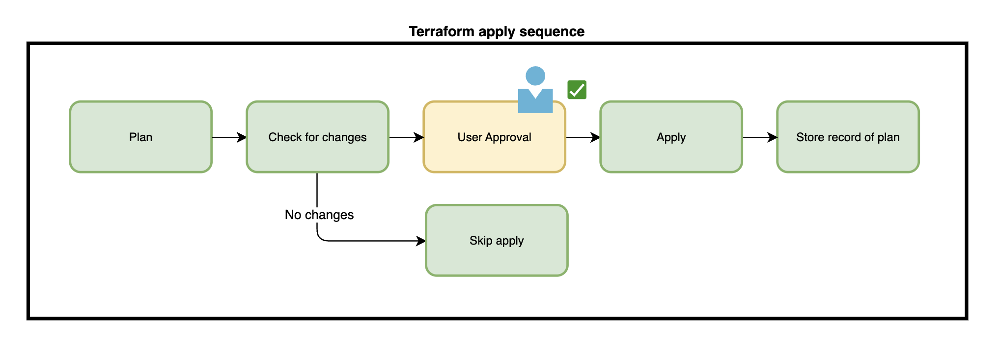
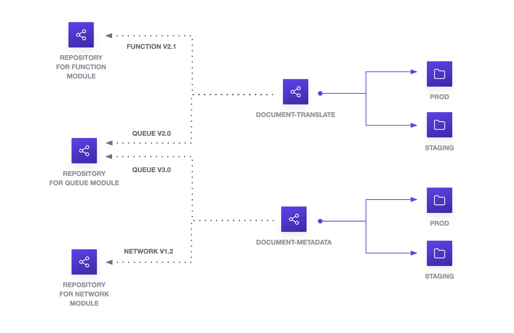

<!-- _class: lead invert -->
<!-- _backgroundColor:  #9CB080 -->
<!-- _footer: Data Team @ TBAuctions -->

# Learnings of a New Data Platform
July 2024

---

<!-- _class: invert -->
<!-- _backgroundColor: #260F1C -->

# Agenda

1. What is the New Data Platform?
1. Way of working
1. How is the CI/CD?
1. Terraform learnings 
1. Next steps

---

<!-- _class: lead -->

## What is the New Data Platform?
<!-- Can also do a multiline
comment that will show in notes -->

At heart, the [data platform](https://www.notion.so/tbauctions/Data-Platform-Architecture-bfab95f56f394cc4b7b9e9d0ef7eafd7?pvs=4#eef2c1caeca04e1ab7b98dcce24079f7) is a data lake, with a number of additional services built on top of it.
<!-- _footer: C4 Architecture - System View -->
---
<!-- _class: lead-->

## Environment Context

<!-- _footer: C4 Architecture - System View -->

---
<!-- _class: lead-->

## Production Environment

<!-- _footer: C4 Architecture - Container View -->

---
<!-- _class: lead-->

## Transformations Component

<!-- _footer: C4 Architecture - Component View -->

---
<!-- _class: lead invert -->

## Way of working
<!-- _backgroundColor: #260F1C -->

>1. Make RFCs and ADR
>1. Hiding is harmful, be transparent
>1. Share knowledge constantly, avoid silos
>1. Have a culture that involves feedback loops - PR reviews, code reviews, retros, request for comments (RFCs)
>
> — *[Data Engineering Team](https://www.notion.so/tbauctions/Engineering-ac362ef5bd78478f9c9f728698b1a3b6?pvs=4)*

---

<!-- _class: default -->

# RFC & ADRs

*Design before coding (doesn't need to be a long tedious task)*

---

<!-- _class: invert -->
<!-- _backgroundColor: #260F1C -->
<!-- _footer: Way of Working -->

# Share knowledge

- Documentation (which is easy to find)
  - Wiki
  - Readme.md
  - Captain Logs
  - Operations manual
  - PR Template

---
<!-- _class: lead -->

## How is the CI/CD?

<table>
<thead>
<tr><th >Pre-commit</th><th >CI</th><th colspan="2">CD</th></tr>
</thead>
<thead >
<tr><th class="second-header">Hooks</th><th class="second-header">Integration</th><th class="second-header">Planning</th><th class="second-header">Deployment</th></tr>
</thead>
<tbody>
<tr><td>Trailing Whitespace</td><td>Tfm Fmt</td><td> Remote Backend </td><td> Copy tfplan </td></tr>
<tr><td>End of File Fixer</td><td>Tfm Validate</td><td> lockBehavior  </td><td> Tfm Apply </td></tr>
<tr><td>Terraform Docs</td><td><del> Tfsec </del> Trivy </td><td> Tfm Plan</td><td>  </td></tr>
<tr><td>Terraform Fmt</td><td> </td><td> PlanHasChanges </td><td>  </td></tr>
<tr><td>Terraform Validate</td><td> </td><td> Env check </td><td>  </td></tr>
<tr><td><del> Tfsec </del>  Trivy </td><td> </td><td> </td><td>  </td></tr>
</tbody>
</table>

<!-- _footer: CI/CD Infrastructure -->

---

<!-- _class: lead -->

## Terraform Apply Sequence

<!-- _footer: CI/CD Infrastructure -->

---

<!-- class: default -->
## Monorepo vs Multi Repo
<!-- Can also do a multiline
comment that will show in notes -->

  

*Keep it simple!*

---

<!-- class: invert  -->
<!-- _backgroundColor: #260F1C -->

## Terraform Learnings
1. Use map variables to configure resource dependencies.

---

<!-- class: invert  -->
<!-- _backgroundColor: #260F1C -->

## Terraform Learnings
1. Things can get very complex

---

<!-- class: invert  -->
<!-- _backgroundColor: #260F1C -->

## Terraform Learnings
2. Refactoring code is painful

---

<!-- class: invert  -->
<!-- _backgroundColor: #260F1C -->

## Next Steps
1. Quality Code

