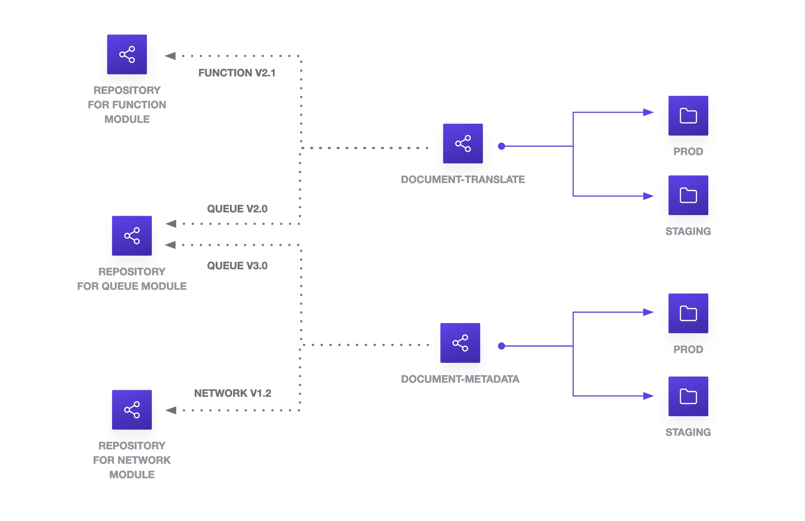

<!-- _class: lead invert -->
<!-- _backgroundColor:  #9CB080 -->
<!-- _footer: Data Team @ TBAuctions -->

# Learnings of a New Data Platform
July 2024


---

<!-- _class: invert -->
<!-- _backgroundColor: #260F1C -->

# Agenda


1. What is the New Data Platform?
1. Way of working
1. How is the CI/CD?
1. Terraform learnings
1. Next steps


---

<!-- class: lead -->

## What is the New Data Platform?
<!-- Can also do a multiline
comment that will show in notes -->


At heart, the [data platform](https://www.notion.so/tbauctions/Data-Platform-Architecture-bfab95f56f394cc4b7b9e9d0ef7eafd7?pvs=4#eef2c1caeca04e1ab7b98dcce24079f7) is a data lake, with a number of additional services built on top of it.
<!-- _footer: C4 Architecture - System View -->
---

## Environment Context


<!-- _footer: C4 Architecture - System View -->

---

## Production Environment


<!-- _footer: C4 Architecture - Container View -->

---

## Transformations Component


<!-- _footer: C4 Architecture - Component View -->

---
<!-- _class: lead invert -->


## Way of working
<!-- _backgroundColor: #260F1C -->

>1. Make RFCs and ADR
>1. Hiding is harmful, be transparent
>1. Share knowledge constantly, avoid silos
>1. Have a culture that involves feedback loops - PR reviews, code reviews, retros, request for comments (RFCs)
>
> — *[Data Engineering Team](https://www.notion.so/tbauctions/Engineering-ac362ef5bd78478f9c9f728698b1a3b6?pvs=4)*

---

<!-- _class: default -->

# RFC & ADRs

*Design before coding (doesn't need to be a long tedious task)*


---

<!-- _class: invert -->
<!-- _backgroundColor: #260F1C -->
<!-- _footer: Way of Working -->

# Share knowledge

- Documentation (which is easy to find)
  - Wiki
  - Readme.md
  - Captain Logs
  - Operations manual
  - PR Template

---
<!-- class: lead -->

## How is the CI/CD?


<table>
<thead>
<tr><th >Pre-commit</th><th >CI</th><th colspan="2">CD</th></tr>
</thead>
<thead >
<tr><th class="second-header">Hooks</th><th class="second-header">Integration</th><th class="second-header">Planning</th><th class="second-header">Deployment</th></tr>
</thead>
<tbody>
<tr><td>Trailing Whitespace</td><td>Tfm Fmt</td><td> Remote Backend </td><td> Copy tfplan </td></tr>
<tr><td>End of File Fixer</td><td>Tfm Validate</td><td> lockBehavior  </td><td> Tfm Apply </td></tr>
<tr><td>Terraform Docs</td><td><del> Tfsec </del> Trivy </td><td> Tfm Plan</td><td>  </td></tr>
<tr><td>Terraform Fmt</td><td> </td><td> PlanHasChanges </td><td>  </td></tr>
<tr><td>Terraform Validate</td><td> </td><td> Env check </td><td>  </td></tr>
<tr><td><del> Tfsec </del>  Trivy </td><td> </td><td> </td><td>  </td></tr>
</tbody>
</table>

<!-- _footer: CI/CD Infrastructure -->


---


## Environment Management


<!-- _footer: CI/CD Infrastructure -->


---


## Terraform Apply Sequence


<!-- _footer: CI/CD Infrastructure -->


---

## Monorepo vs Multi Repo
<!-- Can also do a multiline
comment that will show in notes -->


*Keep it simple 👌*

---

<!-- class: invert  -->
<!-- backgroundColor: #260F1C -->

## Terraform Learnings
1. Use map variables to configure resource dependencies.

```json
users = {
  "r.bonillaibarra@tbauctions.com" = {
    display_name = "Roberto Bonilla",
    member_of    = ["marketing","intelligent_auctioning"]
    catalog_name = "r_bonilla"
  },
  "b.lucieer@tbauctions.com" = {
    display_name = "Bas Lucieer",
    member_of    = ["intelligent_auctioning"]
  }
}
```

---

<!-- class: invert  -->

## Terraform Learnings
2. There is a tradeoff of functionality vs complexity

```py
locals {
  # Flatten ensures that this local value is a flat list of objects
  power_users = flatten([
    for user_email, user_data in var.users : [
      for group in user_data.member_of : {
        email      = user_email
        group_name = group
        group_id   = databricks_group.pwu_group[group].id
        member_id  = databricks_user.pwu[user_email].id
      }
    ]
  ])
}
```

---


<!-- class: invert  -->

## Terraform Learnings
3. Refactoring code into modules can be quite painful

```json
moved {
  from = databricks_sql_endpoint.small
  to   = module.databricks_sql_endpoint["segment_sql_endpoint"].databricks_sql_endpoint.default
}

moved {
  from = databricks_permissions.endpoint_usage
  to   = module.databricks_sql_endpoint["segment_sql_endpoint"].databricks_permissions.endpoint_usage
}
```

---


<!-- class: invert  -->

## Terraform Learnings
4. Protect stateful resources

```json
resource "azurerm_databricks_workspace" "databricks" {
  name                        = var.databricks_workspace_name
  resource_group_name         = var.resource_group_name
  location                    = var.location.full
  sku                         = "premium"
  managed_resource_group_name = local.managed_resource_group_name
  tags                        = var.tags

  lifecycle {
    prevent_destroy = true
  }
}
```

---


<!-- class: invert  -->

## Terraform Learnings
5. There is no one source of truth, it always depends.
<p align="center" width="60%">
    
</p>

---
<!-- _backgroundColor:  #9CB080 -->
<!-- class: invert  -->

## Data Learnings
6. Staying open source, maintaining custom solutions can be painful


---

<!-- backgroundColor: custom-gaia -->
<!-- class: default  -->

## Next Steps
1. Building a Power Users Community

<p align="center" width="180%">
    
    <div align="center" class="caption">Reforge</div>
</p>

---

## Next Steps
2. CDC for efficient tracking of incremental changes and near real-time synchronization.

<p align="center" width="180%">
    
    <div align="center" class="caption">Fivetran</div>
</p>

---


## Next Steps
3. With the Batch layer in place, our next focus will be on developing the Speed layer and the Serving layer.

<p align="center" width="100%">
    
    <div align="center" class="caption">Databricks</div>
</p>

---


## Next Steps
4. Improve quality code with Sonar Cloud

<p align="center" width="160%">

    <div align="center" class="caption">SonarSource </div>
</p>

---


## Sources

1. [Google's Terraform Best Practices](https://cloud.google.com/docs/terraform/best-practices/general-style-structure#custom-scripts)

2. [C4 Architecture](https://c4model.com/)

3. [Spotify - When Should I Write an Architecture Decision Record](https://engineering.atspotify.com/2020/04/when-should-i-write-an-architecture-decision-record/)

4. [Reforge - The Power Users Trap](https://www.reforge.com/blog/the-power-user-trap)

---

<!-- _class: lead invert -->
<!-- _backgroundColor:  #9CB080 -->
<!-- _footer: Data Team @ TBAuctions -->


# Questions and Feedback


